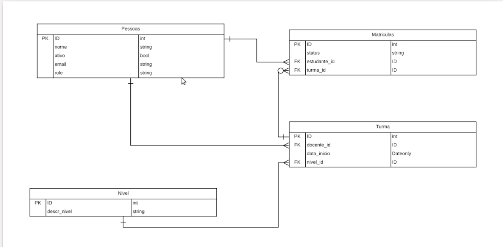

# orm-sequelize

## 📋 Índice
- [📖 Sobre](#-Sobre)
- [🚀 Tecnologias utilizadas](#-Tecnologias-utilizadas)
- [📌 Como executar o projeto](#-Como-executar-o-projeto)
- [💻 Comandos do sequelize-cli usados](#-Comandos-do-sequelize-cli-usados)
- [🎓 Certificados](#-Certificados)

## 📖 Sobre
Projeto desenvolvido durante os cursos [Curso de ORM com NodeJS: API com Sequelize e MySQL](https://cursos.alura.com.br/course/orm-nodejs-api-sequelize-mysql) da Alura.

> Diagrama usado de referência do projeto:


## 🚀 Tecnologias utilizadas
O projeto foi desenvolvido utilizando as seguintes tecnologias:

- [Node.js](https://nodejs.org/en)
- [Express](https://expressjs.com/)
- [MySQL](https://www.mysql.com/)
- [Sequelize](https://sequelize.org/)
- [sequelize-cli](https://github.com/sequelize/cli)
- [Docker](https://www.docker.com/)

## 📌 Como executar o projeto

Primeiro é preciso subir uma instância do mysql:
```bash
docker pull mysql

docker run 
  --name english-school
  -p 3306:3306
  -e MYSQL_ROOT_PASSWORD=root
  -e MYSQL_DATABASE=english-school
  -d mysql

docker start english-school
```

Execute o projeto node:
```bash
npm run dev
```
## 💻 Comandos do sequelize-cli usados

```bash
# Criando o modelo e a migração de Pessoas
npx sequelize-cli model:create --name Pessoas --attributes nome:string,ativo:boolean,email:string,role:string

# Inserindo as migrations pendentes no banco de dados
npx sequelize-cli db:migrate

# Gerando um novo arquivo de seed para o modelo Pessoas
npx sequelize-cli seed:generate --name demo-pessoa

# Inserindo os dados das seeds no banco
npx sequelize-cli db:seed:all

# Criando os novos modelos e migrações
npx sequelize-cli model:create --name Niveis --attributes descr_nivel:string

npx sequelize-cli model:create --name Turmas --attributes data_inicio:dateonly

npx sequelize-cli model:create --name Matriculas --attributes status:string

# Depois de fazer as associações e referências no código, basta rodar:
npx sequelize-cli db:migrate

# criando os seeds para popular as tabelas
npx sequelize-cli seed:generate --name demo-nivel

npx sequelize-cli seed:generate --name demo-turmas

npx sequelize-cli seed:generate --name demo-matriculas

# Inserindo os dados das seeds no banco
npx sequelize-cli db:seed:all
```

## 🎓 Certificados
### [ORM com NodeJS: API com Sequelize e MySQL](https://cursos.alura.com.br/certificate/d72a0efc-d5bf-4d51-8fd0-220fba2f7908?lang=pt_BR)
